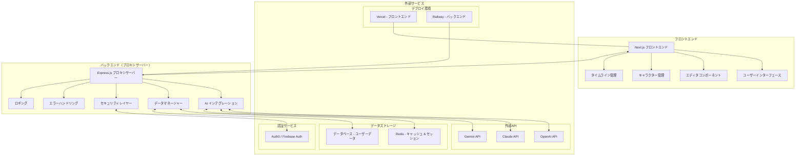

# ノベル作成エージェント 外部サービス構成

## 構成図

## 外部サービス詳細説明

### デプロイ環境

#### Vercel

- **用途**: フロントエンドのホスティング
- **メリット**:
  - Next.js との完全な互換性
  - 自動デプロイと継続的インテグレーション
  - エッジネットワークによる高速配信
  - プレビュー環境の自動生成

#### Railway

- **用途**: バックエンド（プロキシサーバー）のホスティング
- **メリット**:
  - Node.js アプリケーションの簡単なデプロイ
  - 自動スケーリング
  - データベースとの統合が容易
  - GitHub との連携による自動デプロイ

### 外部 API

#### OpenAI API

- **用途**: 高品質なテキスト生成、物語展開の提案
- **モデル**: GPT-4、GPT-3.5-Turbo
- **機能**:
  - コンテキスト認識の物語生成
  - キャラクター対話
  - プロット提案

#### Claude API (Anthropic)

- **用途**: 長文コンテキストでの物語生成、メタストーリーラインの構築
- **モデル**: Claude 3 Opus、Claude 3 Sonnet
- **機能**:
  - 著者スタイルの模倣
  - 物語の一貫性維持
  - 詳細な背景設定

#### Gemini API (Google)

- **用途**: 代替 AI 生成エンジン、マルチモーダル機能
- **モデル**: Gemini Pro、Gemini Ultra
- **機能**:
  - テキストと画像の統合処理
  - 物語の視覚的要素の生成

### データストレージ

#### Redis

- **用途**: 高速キャッシュ、セッション管理
- **機能**:
  - AI 生成結果の一時保存
  - ユーザーセッション
  - レート制限の実装

#### データベース

- **候補**: MongoDB、PostgreSQL
- **用途**: ユーザーデータの永続化
- **保存データ**:
  - 小説プロジェクト
  - キャラクターシート
  - タイムラインイベント
  - ユーザー設定

### 認証サービス

#### Auth0 / Firebase Auth

- **用途**: ユーザー認証と認可
- **機能**:
  - ソーシャルログイン
  - JWT ベースの認証
  - アクセス制御
  - セキュリティ強化

## 連携フロー

1. ユーザーは Vercel でホストされたフロントエンドにアクセス
2. 認証後、フロントエンドは Railway でホストされたバックエンド API と通信
3. バックエンドは OpenAI/Claude/Gemini API にリクエストを送信し、結果を処理
4. 生成されたコンテンツは Redis に一時キャッシュされ、最終的にデータベースに保存
5. ユーザーへのレスポンスはバックエンドからフロントエンドを経由して返される

## 実装計画

### フェーズ 1: 基本機能デプロイ

- Vercel にフロントエンドをデプロイ
- Railway にシンプルなプロキシサーバーをデプロイ
- OpenAI API との基本連携

### フェーズ 2: 拡張機能

- Claude API と Gemini API の追加
- Redis キャッシュの実装
- 認証システムの導入

### フェーズ 3: データ永続化

- データベース連携
- ユーザーデータの永続化
- データのバックアップ機能

## 技術スタック要約

### フロントエンド

- Next.js 15
- React 19
- TypeScript
- Shadcn UI / Radix UI
- Tailwind CSS

### バックエンド

- Express.js
- TypeScript
- Redis
- MongoDB / PostgreSQL

### デプロイ

- Vercel (フロントエンド)
- Railway (バックエンド)

### 外部 API

- OpenAI API
- Claude API
- Gemini API

この構成により、フロントエンドとバックエンドが分離され、それぞれに最適なホスティング環境でサービスを提供できます。また、AI サービスへの依存を抽象化することで、将来的な変更や拡張も容易になります。
